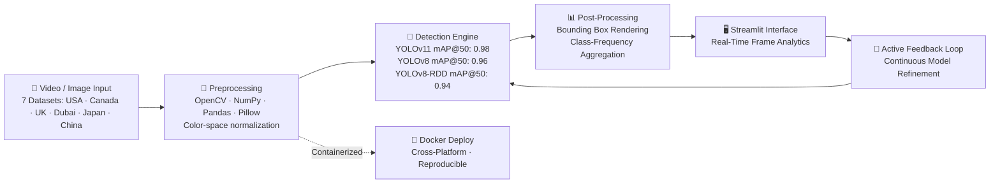
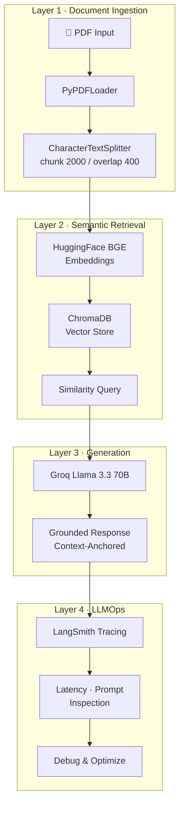

<!-- ============================================================ -->
<!--  SENIOR AI ENGINEER — VAMSHI KRISHNA MACHA                  -->
<!--  Production AI Systems · Computer Vision · RAG · LLMOps     -->
<!-- ============================================================ -->

<p align="center">
  
</p>

<p align="center">
  
</p>

<h1 align="center">
  
</h1>

<p align="center">
  
  
  
  
</p>

<p align="center">
  <a href="mailto:vamshikrishnamacha1358@gmail.com">
    
  </a>
  &nbsp;
  <a href="https://www.linkedin.com/in/vamshi-krishna-macha-56b9181b4/">
    
  </a>
  &nbsp;
  <a href="https://www.kaggle.com/vamshikrishnamacha">
    
  </a>
  &nbsp;
  <a href="https://github.com/VamshiKrishnaMacha">
    
  </a>
</p>

<p align="center">
  📱 <b>+91 79936 10145</b> &nbsp;·&nbsp; 📍 <b>Hyderabad, India</b> &nbsp;·&nbsp; 🌐 <b>Remote · Hybrid · Open to Relocation</b>
</p>

---

## `whoami`

```diff
@@ AI Engineer building production-grade, observable, and grounded AI systems @@

+ Architecting agentic AI workflows — LangChain · Groq LLMs · ChromaDB · MCP protocol
+ End-to-end RAG pipelines — BGE embeddings, vector search, semantic retrieval at scale
+ Computer Vision at production fidelity — YOLOv8, YOLOv11, YOLOv8-RDD, OpenCV
+ LLMOps observability — LangSmith tracing, prompt inspection, latency profiling
+ Multi-environment deployment — Docker containerization, GPU-accelerated inference
+ Data engineering pipelines — Python, NumPy, Pandas, SQL, Power BI, Tableau
```

> **Currently at AiSPRY:** Leading AI-based road infrastructure monitoring across **7 international datasets** (USA · Canada · UK · Dubai · Japan · China), achieving **YOLOv11 mAP@50: 0.98 · F1: 0.96**. Simultaneously shipping a production RAG-based PDF chatbot with LangSmith observability, Groq Llama 3.3 70B, and a modular 4-layer architecture.

> **Philosophy:** *The best AI systems are observable, maintainable, and grounded — from vector search to production monitoring.*

<table align="right">
<tr>
<td>

```
┌──────────────────────────────────────────┐
│  STATUS                                  │
├──────────────────────────────────────────┤
│ 🟢  Open to AI Engineering Roles         │
│ 🎯  CV · RAG · LLMOps · Agentic AI      │
│ 📍  Remote · Hybrid · Relocation OK      │
│ 🏫  SUNY Potsdam + WorldQuant MS Fellow │
└──────────────────────────────────────────┘
```

</td>
</tr>
</table>

<br clear="right"/>

---

## 🏗️ Production AI Systems

### `01` — AI-Based Road Infrastructure Monitoring System

> **`YOLOv8 · YOLOv11 · YOLOv8-RDD · OpenCV · Streamlit · Docker`**

Production-grade computer vision pipeline for high-fidelity detection of road infrastructure anomalies — lane markings, zebra crossings, stop lines, directional arrows, potholes, and road cracks — evaluated across **7 international datasets**.

#### 📊 Detection Model Performance

| Model | Precision | Recall | F1 Score | mAP@50 | mAP@50-95 |
|:------|:---------:|:------:|:--------:|:------:|:---------:|
| **YOLOv11** | **0.95** | **0.96** | **0.96** | **0.98** | **0.81** |
| YOLOv8 | 0.92 | 0.93 | 0.93 | 0.96 | 0.78 |
| YOLOv8-RDD | 0.89 | 0.90 | 0.90 | 0.94 | 0.74 |

**Engineering Highlights:**
- 🌍 Evaluated across **7 geographically diverse datasets**: USA, Canada, UK, Dubai, Japan, China
- 🏗️ Multi-stage pipeline — frame extraction → preprocessing → detection → bounding-box rendering
- ⚡ Real-time inference interface with frame-level analytics and class-frequency aggregation
- 🔄 Continuous feedback loops for model refinement (active learning pattern)
- 📦 Fully containerized via Docker — deterministic, cross-platform builds
- 🎨 High-throughput preprocessing with NumPy, Pandas, Pillow and color-space normalization
- 📝 Research Paper: *AI-Based Road Marking and Road Damage Detection Using YOLOv8 and YOLOv11* — **2026**

<p align="left">
  
  
  
  
  
  
  
</p>

---

### `02` — RAG-Based PDF Chatbot with LLMOps Monitoring

> **`LangChain · ChromaDB · Groq · HuggingFace BGE · LangSmith · Streamlit`**

End-to-end retrieval-augmented generation system enabling context-aware, grounded Q&A over enterprise PDF documents. Built on a modular **4-layer architecture** — fully observable from ingestion to response.

**System Architecture:**

```
┌─────────────────────────────────────────────────────────────────────────┐
│  LAYER 1 · Document Ingestion                                           │
│  PDF → PyPDFLoader → CharacterTextSplitter (chunk 2000 / overlap 400)  │
├─────────────────────────────────────────────────────────────────────────┤
│  LAYER 2 · Semantic Retrieval                                           │
│  HuggingFace BGE Embeddings → ChromaDB Vector Store → Similarity Query │
├─────────────────────────────────────────────────────────────────────────┤
│  LAYER 3 · Response Generation                                          │
│  Groq Llama 3.3 70B Versatile → Context-Anchored Answer Synthesis      │
├─────────────────────────────────────────────────────────────────────────┤
│  LAYER 4 · LLMOps Observability                                         │
│  LangSmith Tracing → Latency Analysis → Prompt Inspection → Debugging  │
└─────────────────────────────────────────────────────────────────────────┘
```

**Engineering Highlights:**
- 🔍 Precision retrieval via BGE embeddings with ChromaDB vector search
- 🧠 High-speed inference powered by Groq Llama 3.3 70B — latency-optimized
- 📡 Full observability pipeline with LangSmith: trace every token, every retrieval, every latency
- 🔧 Modular layered design — each stage independently testable and replaceable
- ⚙️ Context-window optimization and prompt engineering for grounded responses only

<p align="left">
  
  
  
  
  
  
  
</p>

---

### `03` — Data Science & Analytics Engineering

> **`Python · SQL · Power BI · Tableau · NumPy · Pandas · Scikit-learn`**

End-to-end analytics and predictive modeling pipelines for business intelligence use cases.

- Statistical analysis and hypothesis testing with NumPy and Pandas
- SQL query design and optimization across large-scale relational datasets
- Interactive executive dashboards in Power BI and Tableau
- Published research: *Analyzing the Impact of Social Media on Consumer Behavior* — [IRJMETS, April 2024](https://www.irjmets.com/)
- ML implementation: CNN architectures for image classification (DeepLearning.AI certified)

<p align="left">
  
  
  
  
  
</p>

<p align="left">
  <a href="https://github.com/VamshiKrishnaMacha?tab=repositories">
    
  </a>
</p>

---

## ⚡ AI Engineering Expertise

<table width="100%">
<tr>
<td width="50%" valign="top">

### 🤖 Agentic AI & LLM Orchestration
- **LangChain** — workflow design, agent orchestration, tool-use pipelines
- **Groq Llama 3.3 70B** — high-speed inference integration
- **Prompt Engineering** — context-window optimization, grounding strategies
- **MCP (Model Context Protocol)** — architecture and server patterns
- Multi-agent reasoning with structured tool-calling

### 🔍 RAG & Semantic Search
- Full RAG pipeline design — document ingestion → retrieval → generation
- **ChromaDB** vector database with **HuggingFace BGE** embeddings
- Chunking strategy optimization — size/overlap tuning for precision retrieval
- Hybrid search and reranking for enterprise knowledge bases
- Low-latency similarity queries at production scale

</td>
<td width="50%" valign="top">

### 🎥 Computer Vision & Deep Learning
- **YOLOv8 / YOLOv11** — custom training, fine-tuning, mAP@50-95 benchmarking
- **YOLOv8-RDD** — road damage detection domain specialization
- **OpenCV** — preprocessing pipelines and real-time inference workflows
- **Ultralytics** ecosystem — training, validation, export, and deployment
- **Roboflow** — dataset curation, annotation, augmentation pipelines

### ⚙️ LLMOps & MLOps Infrastructure
- **LangSmith** — end-to-end tracing, latency analysis, prompt inspection
- **Docker** — containerized AI systems with deterministic, reproducible builds
- GPU-accelerated inference optimization for deep learning workloads
- Real-time production dashboards with **Streamlit**
- Active learning feedback loops for continuous model refinement

</td>
</tr>
</table>

---

## 🏛️ System Architectures

### Road Infrastructure Monitoring Pipeline



### RAG-Based PDF Chatbot Pipeline



---

## 🛠️ Technical Stack

<h4 align="center">AI / ML / Generative AI</h4>
<p align="center">
  
  
  
  
  
  
  
  
  
  
  
  
</p>

<h4 align="center">Frameworks & Tools</h4>
<p align="center">
  
  
  
  
  
  
  
  
  
  
  
</p>

<h4 align="center">Programming & Analytics</h4>
<p align="center">
  
  
  
  
  
  
  
</p>

<h4 align="center">Cloud & Infrastructure</h4>
<p align="center">
  
  
  
  
  
</p>

---

## 📖 Research & Publications

| Title | Venue | Year | Status |
|:------|:------|:----:|:------:|
| **AI-Based Road Marking and Road Damage Detection System Using YOLOv8 and YOLOv11** — *Computer Vision · Intelligent Transportation* | Research Paper — RoadDeet | 2026 | 📝 Final |
| **Analyzing the Impact of Social Media on Consumer Behavior** — *Business Analytics · Consumer Psychology* | [IRJMETS](https://www.irjmets.com/) — International Research Journal | 2024 | ✅ Published |

---

## 📜 Certifications

| Certification | Issuing Organization | Year |
|:--------------|:--------------------:|:----:|
| 🎖️ Oracle Generative AI Professional | Oracle University | 2025 |
| 🎖️ Oracle AI Vector Search Professional | Oracle University | 2025 |
| 🎖️ Oracle Data Science Professional | Oracle University | 2025 |
| 🎖️ Convolutional Neural Networks | DeepLearning.AI | 2026 |
| 🎖️ Gemini Certified University Student | Google | 2025 |
| 🎖️ Career Essentials in Generative AI | Microsoft & LinkedIn | 2024 |

---

## 🏆 Awards & Recognition

<table align="center" width="95%">
  <tr>
    <td width="33%" align="center" valign="top">

### 🏆 i-Hub Innovation Challenge
**Grant Awardee**
Secured **₹2,56,000** grant for an innovative startup proposal.
*i-Hub Gujarat · 2021*

  </td>
  <td width="33%" align="center" valign="top">

### 🌐 Global Finance Trainee
**International Honoree**
Selected as Global Finance Trainee — international recognition program.
*Ureka Education Group · 2020*

  </td>
  <td width="33%" align="center" valign="top">

### 🥇 Gold Medal
**Class First**
National-level science competition excellence.
*Science Olympiad Foundation · 2012*

  </td>
  </tr>
</table>

---

## 🎓 Education

| Institution | Degree / Program | Period | Location |
|:------------|:-----------------|:------:|:--------:|
| 🎓 **State University of New York, Potsdam** | Diploma in Data Science & Artificial Intelligence | Apr 2026 – Oct 2026 | 🇺🇸 USA |
| 🎓 **WorldQuant University** | MS – Financial Engineering *(Fellowship Program)* | Oct 2025 – Nov 2027 | 🇺🇸 USA |
| 🎓 **Parul University** | MBA – Big Data & Business Analytics | Jul 2022 – May 2024 | 🇮🇳 India |
| 🎓 **Parul University** | BBA – Business Administration (International Business) | Jul 2019 – Apr 2022 | 🇮🇳 India |

---

## 🗺️ AI Engineering Roadmap

```
MASTERED                              ADVANCING                        NEXT
━━━━━━━━━━━━━━━━━━━━━━━━━━━━━━━━━━━━━━━━━━━━━━━━━━━━━━━━━━━━━━━━━━━━━━━━━━━━━━

[████████████] Python & Data Engineering    [████████░░] Multi-Agent Orchestration
[████████████] Machine Learning             [██████░░░░] Advanced RAG Patterns
[████████████] Deep Learning (CNN)          [██████░░░░] Agentic AI Systems
[████████████] Computer Vision (YOLO)       [████████░░] LLMOps at Production Scale
[████████████] RAG & Vector Databases       [░░░░░░░░░░] Fine-Tuning (LoRA / QLoRA)
[████████████] MLOps & LLMOps              [░░░░░░░░░░] Real-Time Edge Deployment
[████████████] GenAI & Prompt Engineering   [░░░░░░░░░░] TensorRT Optimization
[████████░░░░] Oracle Cloud / OCI           [░░░░░░░░░░] Kubernetes for AI Workloads
[████████░░░░] Business Analytics & BI      [░░░░░░░░░░] Multi-Modal LLMs
```

---

<p align="center">
  
</p>

<p align="center">
  <i>Building observable, maintainable, and grounded AI systems — from vector search to production monitoring.</i>
  <br/>
  <b>Vamshi Krishna Macha · AI Engineer · Hyderabad, India</b>
</p>
