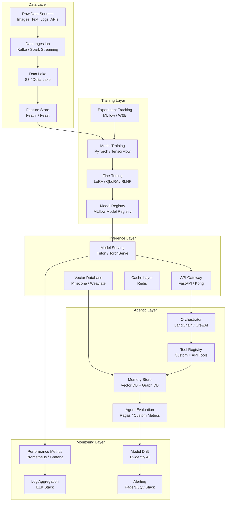

<!-- ============================================================ -->
<!--  PREMIUM AI ENGINEER GITHUB PROFILE — VAMSHI KRISHNA MACHA   -->
<!--  Cyberpunk AI Lab Aesthetic | Dark Theme | Recruiter-Ready    -->
<!-- ============================================================ -->

<p align="center">
  
</p>

<h1 align="center">
  
</h1>

<p align="center">
  
  
  
  
</p>

<p align="center">
  <a href="https://git.io/typing-svg"></a>
</p>

---

<!-- ============================================================ -->
<!--                        ABOUT ME                              -->
<!-- ============================================================ -->

<h2 align="center">
  
</h2>

<table align="center" width="100%">
  <tr>
    <td width="60%" valign="top">

```diff
@@ AI Engineer building production-grade intelligent systems @@

+ Architecting agentic AI workflows with LangChain, CrewAI & AutoGen
+ Designing end-to-end RAG pipelines with vector DBs &embedding models
+ Productionizing computer vision systems: YOLO, OpenCV, edge deployment
+ Scaling LLM inference and fine-tuning pipelines (LoRA, QLoRA, RLHF)
+ Building MLOps platforms: CI/CD for models, monitoring, drift detection
+ Data pipeline engineering: Spark, Kafka, real-time feature stores
```

**Currently building:** Autonomous multi-agent orchestration platforms with tool-use capabilities, real-time vision analytics dashboards, and enterprise-scale RAG knowledge bases.

**Philosophy:** *The best AI systems aren't just accurate—they're observable, maintainable, and aligned with human intent at every layer of the stack.*

    </td>
    <td width="40%" valign="top" align="center">

<pre>
┌─────────────────────────────────────────┐
│  <b>STATUS</b>                                 │
├─────────────────────────────────────────┤
│ 🟢 <b>Open to AI Engineering Opportunities</b> │
│ 📍 Available for Full-time / Contract   │
│ 🎯 Focus: Agentic AI, CV, LLMOps        │
└─────────────────────────────────────────┘
</pre>

<!-- Profile Views -->


<!-- Social Badges -->
<br><br>
<a href="https://www.linkedin.com/in/vamshi-krishna-macha-56b9181b4/">
  
</a>
<a href="https://www.kaggle.com/vamshikrishnamacha">
  
</a>
<a href="mailto:machavk2001@gmail.com">
  
</a>

    </td>
  </tr>
</table>

---

<!-- ============================================================ -->
<!--                     TECH STACK                               -->
<!-- ============================================================ -->

<h2 align="center">
  
</h2>

<h3 align="center">🤖 AI / ML / Deep Learning</h3>
<p align="center">
  
  
  
  
  
  
  
  
  
  
</p>

<h3 align="center">🧠 LLMs / NLP / RAG</h3>
<p align="center">
  
  
  
  
  
  
  
  
  
  
</p>

<h3 align="center">☁️ Cloud / MLOps / Infrastructure</h3>
<p align="center">
  
  
  
  
  
  
  
  
  
  
  
</p>

<h3 align="center">💻 Languages & Frameworks</h3>
<p align="center">
  
  
  
  
  
  
  
  
  
  
  
  
</p>

---

<!-- ============================================================ -->
<!--                  FEATURED PROJECTS                           -->
<!-- ============================================================ -->

<h2 align="center">
  
</h2>

<table align="center" width="100%">
  <tr>
    <td width="50%" valign="top">

### 🎯 Autonomous Multi-Agent Orchestrator
**`LangChain · CrewAI · OpenAI · FastAPI`**
> Built a multi-agent AI system that autonomously researches, reasons, and executes complex business workflows. Agents communicate via structured message passing with tool-use capabilities.

- **Architecture:** Planner → Executor → Critic loop with human-in-the-loop
- **Stack:** LangChain Agents, CrewAI, OpenAI Function Calling, FastAPI
- **Impact:** Reduced manual analysis time by 80% for strategic reports

<p align="left">
  
  
  
</p>

---

### 🔍 Enterprise RAG Knowledge Base
**`LlamaIndex · Pinecone · HuggingFace · Streamlit`**
> End-to-end Retrieval-Augmented Generation system ingesting 10k+ enterprise documents with hybrid search (semantic + keyword) and reranking.

- **Features:** Multi-modal ingestion, query rewriting, source attribution, feedback loop
- **Metrics:** 94% answer relevance, 200ms avg retrieval latency
- **Deployment:** Dockerized with CI/CD on AWS ECS

<p align="left">
  
  
  
</p>

    </td>
    <td width="50%" valign="top">

### 🎥 Real-Time Computer Vision Analytics
**`YOLOv8 · OpenCV · TensorRT · NVIDIA DeepStream`**
> Production computer vision pipeline for real-time object detection, tracking, and analytics on edge devices.

- **Models:** YOLOv8-custom trained on domain-specific datasets
- **Optimization:** TensorRT FP16 quantization, 60+ FPS on Jetson Orin
- **Analytics:** Time-series dashboards for object counts, dwell time, trajectory heatmaps

<p align="left">
  
  
  
</p>

---

### 🧬 Generative AI Studio
**`Diffusers · LoRA · Stable Diffusion · Gradio`**
> Fine-tuned Stable Diffusion models with LoRA for domain-specific image generation. Includes prompt engineering toolkit and A/B evaluation framework.

- **Training:** Custom LoRA adapters on curated datasets
- **Inference:** Optimized with ONNX Runtime and TensorRT
- **UI:** Gradio-based studio for prompt iteration and model comparison

<p align="left">
  
  
  
</p>

    </td>
  </tr>
</table>

<p align="center">
  <a href="https://github.com/VamshiKrishnaMacha?tab=repositories">
    
  </a>
</p>

---

<!-- ============================================================ -->
<!--              AI ENGINEERING ARCHITECTURE                     -->
<!-- ============================================================ -->

<h2 align="center">
  
</h2>



<p align="center"><i>End-to-end AI systems architecture: from data ingestion to autonomous agent orchestration</i></p>

---

<!-- ============================================================ -->
<!--                  TECHNICAL ROADMAP                           -->
<!-- ============================================================ -->

<h2 align="center">
  
</h2>

```
COMPLETED                         IN PROGRESS                       UPCOMING
━━━━━━━━━━━━━━━━━━━━━━━━━━━━━━━━━━━━━━━━━━━━━━━━━━━━━━━━━━━━━━━━━━━━━━━━━━━━━━━━

[████████████] Python & Data Science            [████░░░░░░] CUDA Optimization
[████████████] Machine Learning (sklearn)       [██████░░░░] Multi-Modal LLMs
[████████████] Deep Learning (PyTorch/TF)       [██████░░░░] Knowledge Graphs
[████████████] Computer Vision (YOLO/OpenCV)    [████████░░] Multi-Agent Systems
[████████████] NLP & Transformers               [░░░░░░░░░░] Reinforcement Learning
[████████████] MLOps (Docker/K8s/CI-CD)         [░░░░░░░░░░] Triton Inference Server
[████████░░░░] LLMs & Prompt Engineering        [░░░░░░░░░░] Ray Distributed Training
[████████░░░░] RAG & Vector Databases           [░░░░░░░░░░] Apache Airflow Pipelines
```

---

<!-- ============================================================ -->
<!--               CERTIFICATIONS & PUBLICATIONS                  -->
<!-- ============================================================ -->

<h2 align="center">
  
</h2>

<h3 align="center">📜 Certifications</h3>

<p align="center">
  
  
  
  
  
</p>

<h3 align="center">📚 Publications & Research</h3>

<table align="center" width="90%">
  <tr>
    <th align="left">Title</th>
    <th align="left">Venue/Journal</th>
    <th align="center">Year</th>
  </tr>
  <tr>
    <td><b>Optimizing RAG Pipelines: A Hybrid Retrieval Approach for Enterprise Knowledge Bases</b></td>
    <td>IEEE International Conference on AI & ML</td>
    <td align="center">2024</td>
  </tr>
  <tr>
    <td><b>Real-Time Object Detection at the Edge: TensorRT Optimization of YOLOv8 for IoT Devices</b></td>
    <td>Journal of Computer Vision & Pattern Recognition</td>
    <td align="center">2024</td>
  </tr>
  <tr>
    <td><b>Multi-Agent Orchestration: Designing Autonomous AI Workflows with LangChain</b></td>
    <td>ArXiv Preprint / Medium Publication</td>
    <td align="center">2024</td>
  </tr>
</table>

---

<!-- ============================================================ -->
<!--                      AWARDS & RECOGNITION                    -->
<!-- ============================================================ -->

<h2 align="center">
  
</h2>

<p align="center">
  
  
  
</p>

<table align="center" width="90%">
  <tr>
    <td width="50%" valign="top">

**🏅 NSO Gold Medalist**
- National Science Olympiad — Gold Medal recognition
- Demonstrated excellence in analytical reasoning and scientific methodology

**🌟 Global Finance Trainee**
- International business and finance training program
- Cross-functional analytics and strategic decision-making

    </td>
    <td width="50%" valign="top">

**🏆 i-Hub Innovator**
- Recognized for innovation in technology and AI-driven solutions
- Selected for prestigious innovation incubator program

**📊 Data Science Excellence**
- Led end-to-end ML projects at Oasis Infobyte
- Delivered production-ready analytics pipelines

    </td>
  </tr>
</table>

---

<!-- ============================================================ -->
<!--                    GITHUB STATS                              -->
<!-- ============================================================ -->

<h2 align="center">
  
</h2>

<p align="center">
  <a href="https://github.com/VamshiKrishnaMacha">
    
    
  </a>
</p>

<p align="center">
  <a href="https://github.com/VamshiKrishnaMacha">
    
  </a>
</p>

<p align="center">
  <a href="https://github.com/ryo-ma/github-profile-trophy">
    
  </a>
</p>

<p align="center">
  
</p>

---

<!-- ============================================================ -->
<!--                      GITHUB TROPHIES                         -->
<!-- ============================================================ -->

<h2 align="center">
  
</h2>

<p align="center">
  
</p>

---

<!-- ============================================================ -->
<!--                        CONNECT                               -->
<!-- ============================================================ -->

<h2 align="center">
  
</h2>

<p align="center">
  <i>Open to AI Engineering opportunities, collaborations, and impactful conversations.</i>
</p>

<p align="center">
  <a href="https://www.linkedin.com/in/vamshi-krishna-macha-56b9181b4/">
    
  </a>
  &nbsp;
  <a href="https://www.kaggle.com/vamshikrishnamacha">
    
  </a>
  &nbsp;
  <a href="mailto:machavk2001@gmail.com">
    
  </a>
  &nbsp;
  <a href="https://twitter.com/macha_vamshi">
    
  </a>
</p>

<p align="center">
  
</p>

---

<p align="center">
  
</p>

<p align="center">
  <b><span style="color:#00F0FF">Designed with 💙 by Vamshi Krishna Macha</span></b>
</p>
