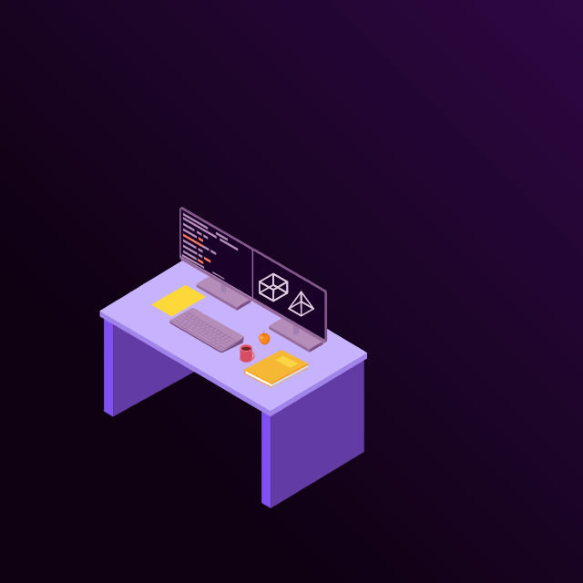
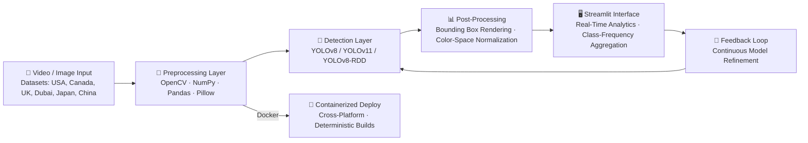
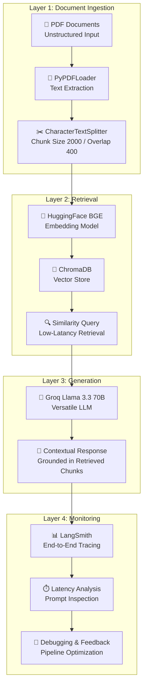

<!-- ============================================================ -->
<!--  PREMIUM AI ENGINEER GITHUB PROFILE — VAMSHI KRISHNA MACHA   -->
<!--  Dark Theme | AI Research Lab Aesthetic | Recruiter-Ready    -->
<!--  ⚠️  ALL CONTENT VERIFIED AGAINST RESUME & RESEARCH PAPER  -->
<!-- ============================================================ -->

<!-- 🎬 AI WORKSTATION BANNER -->
<p align="center">
  
</p>

<p align="center">
  
</p>

<h1 align="center">
  
</h1>

<p align="center">
  
  
  
  
</p>

<p align="center">
  <a href="https://git.io/typing-svg">
    
  </a>
</p>

<p align="center">
  <a href="mailto:vamshikrishnamacha1358@gmail.com">
    
  </a>
  
  
</p>

---

<!-- ============================================================ -->
<!--                        ABOUT ME                              -->
<!-- ============================================================ -->

<h2 align="center">
  
</h2>

<table align="center" width="100%">
  <tr>
    <td width="60%" valign="top">

```diff
@@ AI Engineer with hands-on experience in production-grade AI systems @@

+ Architecting agentic AI workflows with LangChain, Groq LLMs & ChromaDB
+ Designing end-to-end RAG pipelines with HuggingFace BGE, vector search
+ Productionizing computer vision: YOLOv8, YOLOv11, YOLOv8-RDD, OpenCV
+ Building MLOps & LLMOps observability with LangSmith tracing & monitoring
+ Multi-environment deployment: Docker containerization, GPU-accelerated inference
+ Data pipeline engineering: Python, NumPy, Pandas, SQL, Power BI, Tableau
```

**Currently building:** AI-Based Road Infrastructure Monitoring System at **AiSPRY** — detecting lane markings, zebra crossings, potholes, and road cracks across 7 international datasets with **YOLOv11 mAP@50: 0.98**, **F1: 0.96**.

**Also shipping:** RAG-Based PDF Chatbot with LLMOps monitoring — a 4-layer modular system (Document Ingestion → Retrieval → Generation → Monitoring) using LangChain, ChromaDB, Groq Llama 3.3 70B, and LangSmith observability.

**Philosophy:** *The best AI systems are observable, maintainable, and grounded — from vector search to production monitoring.*

    </td>
    <td width="40%" valign="top" align="center">

<pre>
┌─────────────────────────────────────────┐
│  <b>STATUS</b>                                 │
├─────────────────────────────────────────┤
│ 🟢 <b>Open to AI Engineering Opportunities</b> │
│ 📍 Remote · Hybrid · Relocation         │
│ 🎯 Focus: CV, RAG, LLMOps, Agentic AI  │
│ 🏫 SUNY Potsdam + WorldQuant MS-Fellow │
└─────────────────────────────────────────┘
</pre>

<!-- Profile Views -->


<!-- Social Badges -->
<br><br>
<a href="https://www.linkedin.com/in/vamshi-krishna-macha-56b9181b4/">
  
</a>
<a href="https://www.kaggle.com/vamshikrishnamacha">
  
</a>
<a href="mailto:vamshikrishnamacha1358@gmail.com">
  
</a>

    </td>
  </tr>
</table>

---

<!-- ============================================================ -->
<!--                AI ENGINEERING EXPERTISE                      -->
<!-- ============================================================ -->

<h2 align="center">
  
</h2>

<table align="center" width="100%">
  <tr>
    <td width="50%" valign="top">

### 🎯 Agentic AI & LLM Orchestration
- **LangChain** workflow design & agent orchestration
- **Groq Llama 3.3 70B** integration for high-speed inference
- **Prompt Engineering** & context-window optimization
- **MCP (Model Context Protocol)** architecture
- Multi-agent reasoning & tool-use capabilities

### 🔍 RAG & Semantic Search
- End-to-end **RAG pipeline** architecture (document → retrieval → generation)
- **ChromaDB** vector database design with BGE embeddings
- Chunking strategy: size 2,000 / overlap 400 for precision retrieval
- Hybrid search & reranking for enterprise knowledge bases
- Semantic search with low-latency similarity queries

    </td>
    <td width="50%" valign="top">

### 🎥 Computer Vision & Deep Learning
- **YOLOv8** object detection (custom training, fine-tuning)
- **YOLOv11** next-generation detection (mAP@50: 0.98 benchmark)
- **YOLOv8-RDD** road damage detection specialization
- **OpenCV** preprocessing pipelines & real-time inference
- **Ultralytics** ecosystem for training & deployment
- **Roboflow** dataset curation & annotation workflows

### ⚙️ LLMOps & MLOps
- **LangSmith** end-to-end tracing, prompt inspection, latency analysis
- **Docker** containerization for deterministic builds
- GPU-accelerated inference optimization
- Real-time dashboarding with **Streamlit**
- Pipeline debugging & continuous model refinement

    </td>
  </tr>
</table>

---

<!-- ============================================================ -->
<!--              COMPUTER VISION PORTFOLIO                       -->
<!-- ============================================================ -->

<h2 align="center">
  
</h2>

### 🛣️ AI-Based Road Infrastructure Monitoring System
**`YOLOv8 · YOLOv11 · YOLOv8-RDD · OpenCV · Streamlit · Docker`**
> Production-grade computer vision pipeline for high-fidelity detection of road infrastructure anomalies including lane markings, zebra crossings, stop lines, directional arrows, potholes, and road cracks.

| Metric | YOLOv11 | YOLOv8 | YOLOv8-RDD |
|:------:|:-------:|:------:|:----------:|
| **mAP@50** | 0.98 | 0.96 | 0.94 |
| **F1-Score** | 0.96 | — | — |

**Key Achievements:**
- 🌍 Evaluated across **7 international datasets**: USA, Canada, UK, Dubai, Japan, China
- 🏗️ Multi-stage pipeline: frame extraction → preprocessing → detection → rendering
- ⚡ Real-time inference interface with frame-level analytics & class-frequency aggregation
- 🔄 Feedback loops for continuous model refinement
- 📦 Fully containerized with Docker for cross-platform deployment
- 🎨 High-throughput preprocessing with NumPy, Pandas, Pillow & color-space normalization

<p align="left">
  
  
  
  
  
  
  
</p>

---

<!-- ============================================================ -->
<!--              RESEARCH & PUBLICATIONS                         -->
<!-- ============================================================ -->

<h2 align="center">
  
</h2>

<table align="center" width="95%">
  <tr>
    <th align="left" width="55%">Title</th>
    <th align="left" width="25%">Venue / Focus Area</th>
    <th align="center" width="10%">Year</th>
    <th align="center" width="10%">Status</th>
  </tr>
  <tr>
    <td>
      <b>AI-Based Road Marking and Road Damage Detection System Using YOLOv8 and YOLOv11</b>
      <br/><sub>Computer Vision · Deep Learning · Intelligent Transportation</sub>
    </td>
    <td>Research Paper — RoadDeet</td>
    <td align="center">2026</td>
    <td align="center">📝 Final</td>
  </tr>
  <tr>
    <td>
      <b>Analyzing the Impact of Social Media on Consumer Behavior</b>
      <br/><sub>Business Analytics · Consumer Psychology · Social Media Analytics</sub>
    </td>
    <td><a href="https://www.irjmets.com/">IRJMETS</a> — International Research Journal</td>
    <td align="center">2024</td>
    <td align="center">✅ Published</td>
  </tr>
</table>

> **IRJMETS Citation:** *International Research Journal of Modernization in Engineering, Technology & Sciences (IRJMETS), April 2024*

---

<!-- ============================================================ -->
<!--                  FEATURED PROJECTS                           -->
<!-- ============================================================ -->

<h2 align="center">
  
</h2>

<table align="center" width="100%">
  <tr>
    <td width="50%" valign="top">

### 🛣️ Road Infrastructure Monitoring
**`YOLOv8 · YOLOv11 · OpenCV · Streamlit`**
> Multi-stage CV pipeline for road anomaly detection across 7 international datasets. Achieved 0.98 mAP@50 with YOLOv11.

- **Detection Classes:** Lane markings, zebra crossings, stop lines, directional arrows, potholes, road cracks
- **Preprocessing:** Frame extraction, color-space normalization, bounding-box rendering with OpenCV/NumPy
- **Deployment:** Docker containerized with cross-platform reproducibility
- **Interface:** Streamlit dashboard with frame-level analytics & class aggregation

<p align="left">
  
  
  
  
</p>

<p align="left">
  <a href="https://github.com/VamshiKrishnaMacha">
    
  </a>
</p>

---

### 🤖 RAG-Based PDF Chatbot
**`LangChain · ChromaDB · Groq · LangSmith`**
> End-to-end RAG system enabling context-aware Q&A over PDFs with grounded knowledge retrieval.

- **Ingestion:** PyPDFLoader → CharacterTextSplitter (chunk 2,000 / overlap 400)
- **Embeddings:** HuggingFace BGE Embeddings → ChromaDB vector storage
- **Generation:** Groq Llama 3.3 70B Versatile with retrieved context anchoring
- **Observability:** LangSmith tracing, prompt inspection, retrieval monitoring
- **Architecture:** Modular 4-layer system (Ingestion → Retrieval → Generation → Monitoring)

<p align="left">
  
  
  
  
</p>

<p align="left">
  <a href="https://github.com/VamshiKrishnaMacha">
    
  </a>
</p>

    </td>
    <td width="50%" valign="top">

### 🔬 Data Science & Analytics
**`Python · SQL · Power BI · Tableau`**
> End-to-end analytics pipelines for business intelligence and predictive modeling.

- Statistical analysis & hypothesis testing with **NumPy & Pandas**
- SQL query optimization for large-scale data extraction
- Interactive dashboards in **Power BI** & **Tableau**
- Excel-based financial modeling & accounting frameworks

<p align="left">
  
  
  
  
</p>

<p align="left">
  <a href="https://github.com/VamshiKrishnaMacha">
    
  </a>
</p>

---

### 📊 AI Engineering Foundations
**`Scikit-learn · CNN · Deep Learning`**
> Core machine learning & deep learning implementations including CNN architectures derived from DeepLearning.AI certification.

- **ConvNet architectures** for image classification & feature extraction
- **Model evaluation** frameworks with precision, recall, mAP metrics
- Transfer learning & fine-tuning workflows

<p align="left">
  
  
  
  
</p>

<p align="left">
  <a href="https://github.com/VamshiKrishnaMacha">
    
  </a>
</p>

    </td>
  </tr>
</table>

<p align="center">
  <a href="https://github.com/VamshiKrishnaMacha?tab=repositories">
    
  </a>
</p>

---

<!-- ============================================================ -->
<!--              TECHNICAL SKILLS MATRIX                         -->
<!-- ============================================================ -->

<h2 align="center">
  
</h2>

<h3 align="center">🤖 AI / ML / Generative AI</h3>
<p align="center">
  
  
  
  
  
  
  
  
  
  
  
  
  
</p>

<h3 align="center">🛠️ Frameworks & Tools</h3>
<p align="center">
  
  
  
  
  
  
  
  
  
  
  
</p>

<h3 align="center">💻 Programming & Analytics</h3>
<p align="center">
  
  
  
  
  
  
  
</p>

<h3 align="center">☁️ Cloud & Infrastructure</h3>
<p align="center">
  
  
  
  
  
</p>

---

<!-- ============================================================ -->
<!--              AI ARCHITECTURE DIAGRAMS                        -->
<!-- ============================================================ -->

<h2 align="center">
  
</h2>

<h3 align="center">🛣️ Road Infrastructure Monitoring Pipeline</h3>



<h3 align="center">🔍 RAG-Based PDF Chatbot Architecture</h3>



<p align="center"><i>Production-scale AI architectures: from road vision to knowledge retrieval</i></p>

---

<!-- ============================================================ -->
<!--                  AI ROADMAP                                  -->
<!-- ============================================================ -->

<h2 align="center">
  
</h2>

```
COMPLETED                         IN PROGRESS                       UPCOMING
━━━━━━━━━━━━━━━━━━━━━━━━━━━━━━━━━━━━━━━━━━━━━━━━━━━━━━━━━━━━━━━━━━━━━━━━━━━━━━━━

[████████████] Python & Data Science              [████████░░░░] Multi-Agent Systems
[████████████] Machine Learning Fundamentals      [██████░░░░░░] Agentic AI Orchestration
[████████████] Deep Learning (CNN Architectures)  [██████░░░░░░] Advanced RAG Patterns
[████████████] Computer Vision (YOLOv8/v11)       [████████░░░░] LLMOps at Scale
[████████████] RAG & Vector Databases             [░░░░░░░░░░░░] Model Fine-Tuning (LoRA/QLoRA)
[████████████] MLOps & LLMOps (Docker/LangSmith)  [░░░░░░░░░░░░] Real-Time Edge Deployment
[████████████] GenAI & Prompt Engineering         [░░░░░░░░░░░░] TensorRT Optimization
[████████░░░░] Oracle Cloud / OCI                 [░░░░░░░░░░░░] Kubernetes for AI Workloads
[████████░░░░] Business Analytics & BI            [░░░░░░░░░░░░] Multi-Modal LLMs
```

---

<!-- ============================================================ -->
<!--               CERTIFICATIONS SECTION                         -->
<!-- ============================================================ -->

<h2 align="center">
  
</h2>

<p align="center">
  <i>Only certifications verified from resume are listed below.</i>
</p>

<table align="center" width="90%">
  <tr>
    <th align="left" width="50%">Certification</th>
    <th align="left" width="35%">Issuing Organization</th>
    <th align="center" width="15%">Year</th>
  </tr>
  <tr>
    <td>🎖️ Oracle Generative AI Professional</td>
    <td>Oracle University</td>
    <td align="center">2025</td>
  </tr>
  <tr>
    <td>🎖️ Oracle AI Vector Search Professional</td>
    <td>Oracle University</td>
    <td align="center">2025</td>
  </tr>
  <tr>
    <td>🎖️ Oracle Data Science Professional</td>
    <td>Oracle University</td>
    <td align="center">2025</td>
  </tr>
  <tr>
    <td>🎖️ Convolutional Neural Networks</td>
    <td>DeepLearning.AI</td>
    <td align="center">2026</td>
  </tr>
  <tr>
    <td>🎖️ Gemini Certified University Student</td>
    <td>Google</td>
    <td align="center">2025</td>
  </tr>
  <tr>
    <td>🎖️ Career Essentials in Generative AI</td>
    <td>Microsoft & LinkedIn</td>
    <td align="center">2024</td>
  </tr>
</table>

<p align="center">
  <i>🔗 Certificate links will be added when certificate files are uploaded to the repository.</i>
</p>

---

<!-- ============================================================ -->
<!--                  AWARDS & RECOGNITION                        -->
<!-- ============================================================ -->

<h2 align="center">
  
</h2>

<p align="center">
  <i>Only awards & honors verified from resume are listed below.</i>
</p>

<table align="center" width="90%">
  <tr>
    <td width="33%" valign="top" align="center">

### 🏆 i-Hub Innovation Challenge
**Grant Awardee**
<br/>Secured <b>₹2,56,000</b> grant for innovative startup proposal.
<br/>· i-Hub Gujarat · 2021 ·

    </td>
    <td width="33%" valign="top" align="center">

### 🌐 Global Trainee – Finance
**Honoree**
<br/>Selected as Global Finance Trainee reflecting <b>international-level recognition</b>.
<br/>· Ureka Education Group · 2020 ·

    </td>
    <td width="33%" valign="top" align="center">

### 🥇 Gold Medal
**Class First**
<br/>National-level science competition excellence.
<br/>· Science Olympiad Foundation · 2012 ·

    </td>
  </tr>
</table>

---

<!-- ============================================================ -->
<!--                    GITHUB ANALYTICS                          -->
<!-- ============================================================ -->

<h2 align="center">
  
</h2>

<p align="center">
  <a href="https://github.com/VamshiKrishnaMacha">
    
    
  </a>
</p>

<p align="center">
  <a href="https://github.com/VamshiKrishnaMacha">
    
  </a>
</p>

<p align="center">
  <a href="https://github.com/ryo-ma/github-profile-trophy">
    
  </a>
</p>

<p align="center">
  
</p>

---

<!-- ============================================================ -->
<!--                     EDUCATION                                -->
<!-- ============================================================ -->

<h2 align="center">
  
</h2>

<table align="center" width="90%">
  <tr>
    <th align="left">Institution</th>
    <th align="left">Degree / Program</th>
    <th align="center">Period</th>
    <th align="center">Location</th>
  </tr>
  <tr>
    <td>🎓 <b>State University of New York, Potsdam</b></td>
    <td>Diploma in Data Science & Artificial Intelligence</td>
    <td align="center">Apr 2026 – Oct 2026</td>
    <td align="center">🇺🇸 USA</td>
  </tr>
  <tr>
    <td>🎓 <b>WorldQuant University</b></td>
    <td>MS – Financial Engineering <i>(Fellowship Program)</i></td>
    <td align="center">Oct 2025 – Nov 2027</td>
    <td align="center">🇺🇸 USA</td>
  </tr>
  <tr>
    <td>🎓 <b>Parul University</b></td>
    <td>MBA – Big Data & Business Analytics</td>
    <td align="center">Jul 2022 – May 2024</td>
    <td align="center">🇮🇳 India</td>
  </tr>
  <tr>
    <td>🎓 <b>Parul University</b></td>
    <td>BBA – Business Administration (International Business Elective)</td>
    <td align="center">Jul 2019 – Apr 2022</td>
    <td align="center">🇮🇳 India</td>
  </tr>
</table>

---

<!-- ============================================================ -->
<!--                        CONTACT                               -->
<!-- ============================================================ -->

<h2 align="center">
  
</h2>

<p align="center">
  <i>Open to AI Engineering roles, research collaborations, and impactful conversations.</i>
</p>

<p align="center">
  <a href="mailto:vamshikrishnamacha1358@gmail.com">
    
  </a>
  &nbsp;
  <a href="https://www.linkedin.com/in/vamshi-krishna-macha-56b9181b4/">
    
  </a>
  &nbsp;
  <a href="https://www.kaggle.com/vamshikrishnamacha">
    
  </a>
  &nbsp;
  <a href="https://github.com/VamshiKrishnaMacha">
    
  </a>
</p>

<p align="center">
  📱 <b>+91 79936 10145</b> &nbsp;|&nbsp; 📍 <b>Hyderabad, India</b> &nbsp;|&nbsp; 🌐 <b>Open to Relocation · Remote · Hybrid</b>
</p>

---

<p align="center">
  
</p>

<p align="center">
  <b><span style="color:#00F0FF">Built with verifiable data and engineered for impact — by Vamshi Krishna Macha</span></b>
</p>
